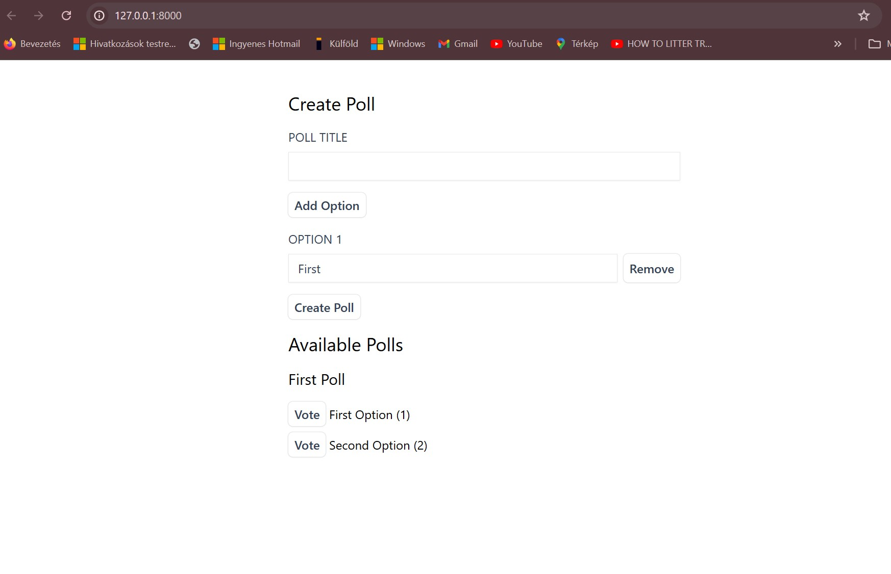

# Laravel Livewire Poll App

## Table of contents
* [General info](#general-info)
* [Description](#description)
* [Screenshot](#screenshot)
* [Technologies](#technologies)
* [Setup](#setup)
  * [Livewire Setup](#livewire-setup)
* [Documentation](#documentation)
* [Status](#status)
* [Created](#created)

## General info

This Laravel Livewire Poll application, built with Laravel 10, provides a simple interface to manage poll votes using Livewire for the [Master Laravel for Beginners & Intermediate 2024 Udemy Course](https://www.udemy.com/course/laravel-beginner-fundamentals/learn/lecture/38206898#overview).

## Description

This Laravel Livewire Poll application is built with Laravel 10 and provides a simple interface to manage poll votes in real-time using Livewire.

## Screenshot

## Technologies

+ Laravel 10
+ PHP 8
+ Livewire 2
+ MySQL
+ Tailwind
+ Docker
+ Blade Templates
+ Adminer DB management

## Setup

Clone the repository:

\`\`\`bash
git clone git@github.com:ivorszaniszlo/livewire-poll-app
\`\`\`

Navigate to the project directory:

\`\`\`bash
cd livewire-poll
\`\`\`

Install dependencies:

\`\`\`bash
composer install
npm install
\`\`\`

Set up environment variables:

\`\`\`bash
cp .env.example .env
php artisan key:generate
\`\`\`

Set up the database and run migrations:

\`\`\`bash
php artisan migrate
\`\`\`

Serve the application:

\`\`\`bash
php artisan serve
\`\`\`

### Livewire Setup

To set up Livewire in your Laravel application, follow these steps:

1. Install Livewire via Composer:

\`\`\`bash
composer require livewire/livewire
\`\`\`

2. Add Livewire styles and scripts to your Blade layout file (usually \`resources/views/layouts/app.blade.php\`):

\`\`\`html
<!DOCTYPE html>
<html>
<head>
    <title>Livewire Poll App</title>
    @livewireStyles
</head>
<body>
    @yield('content')

    @livewireScripts
</body>
</html>
\`\`\`

3. Create a Livewire component for the poll functionality:

\`\`\`bash
php artisan make:livewire PollComponent
\`\`\`

4. Implement the poll logic in the \`PollComponent\` class (located in \`app/Http/Livewire/PollComponent.php\`) and the corresponding Blade view file (located in \`resources/views/livewire/poll-component.blade.php\`).

5. Use the Livewire component in your Blade templates:

\`\`\`html
<livewire:poll-component />
\`\`\`

### Docker Setup

Build and run the Docker containers:

\`\`\`bash
docker-compose up --build
\`\`\`

Access the application at \`http://localhost:8000\`.

## Documentation

Documentation is available in the \`docs\` directory.

## Status

Active

## Created

2024